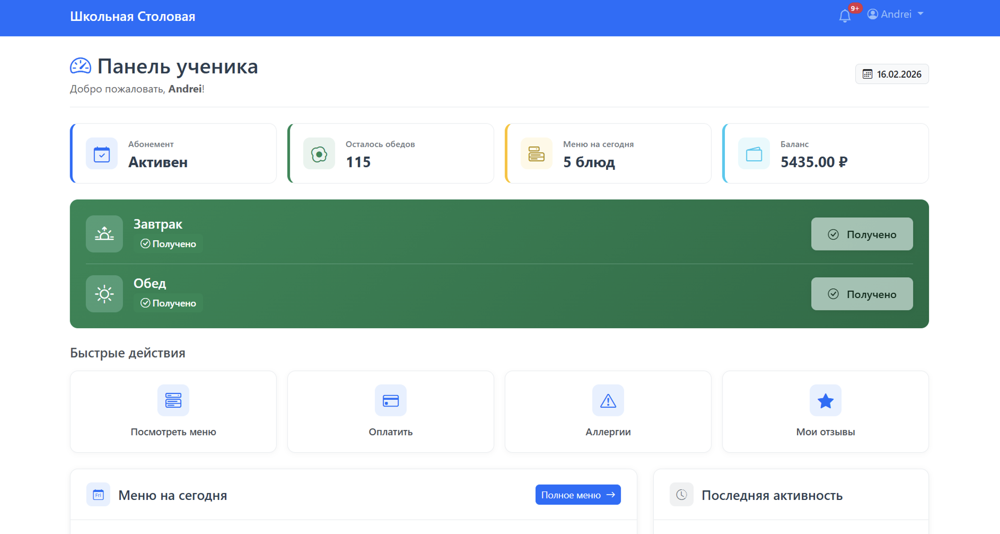

# Система управления школьной столовой



## Технологии

**Backend:** Python / Flask
**Frontend:** Bootstrap 5 + JavaScript
**База данных:** SQLite / MySQL
**Аутентификация:** JWT
**Контейнеризация:** Docker

## Основные возможности

### Ученик
- Просмотр меню и покупка обедов
- Оформление абонементов (недельный/месячный)
- Управление аллергиями и отзывы о блюдах

### Повар
- Отслеживание выдачи обедов
- Управление инвентарём и заявками на закупку

### Администратор
- Статистика посещаемости и финансовая отчётность
- Управление меню, блюдами и пользователями
- Утверждение заявок на закупку

## Быстрый старт

```bash
pip3 install -r requirements.txt

# Все настройки находятся в файле .env
cp .env.example .env

# Инициализация, заполнение БД
python3 -c "from app import create_app, db; app = create_app(); app.app_context().push(); db.create_all()"
python3 seed_data.py

# Запуск
python3 run.py
```

Приложение будет доступно по адресу: **http://localhost:5000**

## Тестовые аккаунты

| Роль | Email | Пароль |
|------|-------|--------|
| Администратор | admin@cafeteria.com | admin123 |
| Повар | cook@cafeteria.com | cook123 |
| Ученик | student@school.com | student123 |

## Структура проекта

```
cafeteria-proj/
├── app/           # Основное приложение
│   ├── api/       # API endpoints
│   ├── models/    # Модели базы данных
│   └── utils/     # Вспомогательные утилиты
├── templates/     # HTML шаблоны
├── static/        # CSS, JS, изображения
├── config.py      # Конфигурация
├── run.py         # Точка входа
└── seed_data.py   # Тестовые данные
```